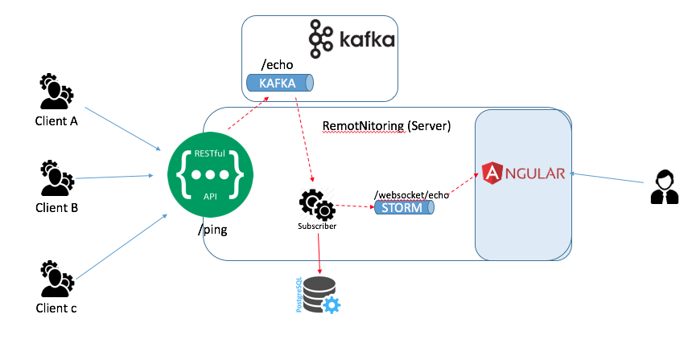
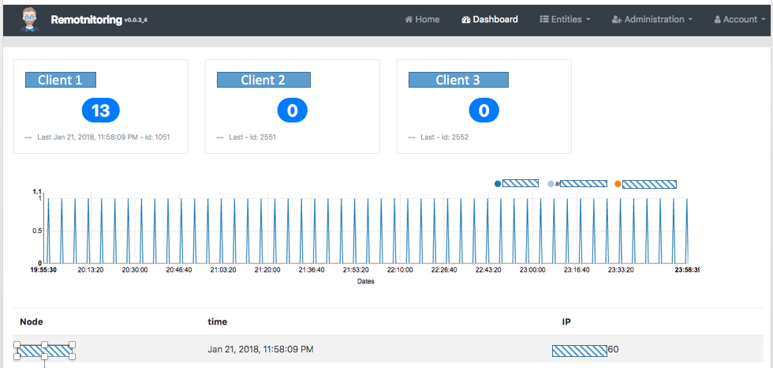

# remotnitoring

## Introduction
Application created to try to do simple remote monitoring. The idea is simple, clients makes REST call to a SERVER which record the pings/heartbeats.

This application is the SERVER that provide a REST endpoint to can do the ping (and login)

From point of view of architecure, it has been created using JHipster but also like a proof of concept has been included:

* KAFKA: [http://kafka.apache.org/](http://kafka.apache.org/). The endpoint PING publish a message to topic and with a service subscribe to the topic read the message and persist the record. For the communication with KAFKA, it has been used [spring-cloud-stream](https://cloud.spring.io/spring-cloud-stream/) 

* Websocket: [spring-websocket](https://docs.spring.io/spring/docs/4.0.1.RELEASE/spring-framework-reference/html/websocket.html) using STOMP messaging protocol. Basically, the service subscribe to the topic, a part of persist the record, also generate a message STOMP to inform to web layer.

* crypto-js: [https://github.com/brix/crypto-js](https://github.com/brix/crypto-js). Library JS to can encrypt or decrypt a "secret" field at web layer. The algorith used AES which required that user introduce a pwd to can encrypt or decrypt.


## Architecture
See diagram of how works the ping/heartbeat



## Funcionallity

### Heartbeats 
> Dashboard



## Deployment
The easy way is using docker-compose. See app.yml
```
app.yml 
version: '2'
services:
    remotnitoring-app:
        image: fmunozse/remotnitoring
        environment:
            - SPRING_PROFILES_ACTIVE=prod,swagger
            - SPRING_DATASOURCE_URL=jdbc:postgresql://remotnitoring-postgresql:5432/remotnitoring
            - SPRING_DATASOURCE_USERNAME=remotnitoring
            - SPRING_DATASOURCE_PASSWORD=password            
            - JHIPSTER_SLEEP=30 # gives time for the database to boot before the application
            - SPRING_CLOUD_STREAM_KAFKA_BINDER_BROKERS=kafka
            - SPRING_CLOUD_STREAM_KAFKA_BINDER_ZK_NODES=zookeeper
        ports:
            - 80:8080

    zookeeper:
        image: wurstmeister/zookeeper:3.4.6

    kafka:
        image: wurstmeister/kafka:0.10.1.1
        environment:
            KAFKA_ADVERTISED_HOST_NAME: <IP local host: localhost>
            KAFKA_ADVERTISED_PORT: 9092
            KAFKA_ZOOKEEPER_CONNECT: zookeeper:2181
            KAFKA_CREATE_TOPICS: "echo:1:1"
        ports:
            - 9092:9092

    remotnitoring-postgresql:
        image: postgres:9.6.5
        volumes:
            - /root/remotnitoring/postgresql/data:/var/lib/postgresql/data
        environment:
            - POSTGRES_USER=remotnitoring
            - POSTGRES_PASSWORD=password

    remotnitoring-postgresql-backup:
        image: fmunozse/pg-cron-backups:9.6.5
        volumes:
          - /root/remotnitoring/backups/:/data/backups/
        environment:
          - DB_HOST=remotnitoring-postgresql
          - DB_NAME=remotnitoring
          - DB_USER=remotnitoring
          - DB_PASS=password
          - CRON_SCHEDULE=30 23 * * *
          - MAIL_GMAIL_USER=remotnitoring.demo.span@gmail.com
          - MAIL_GMAIL_PWD=password
          - MAIL_TO=info.span@gmail.com
          - MAIL_FROM=remotnitoring.demo.span@gmail.com
```


## Development
This application was generated using JHipster 4.11.1, you can find documentation and help at [http://www.jhipster.tech/documentation-archive/v4.11.1](http://www.jhipster.tech/documentation-archive/v4.11.1).


Before you can build this project, you must install and configure the following dependencies on your machine:

1. [Node.js][]: We use Node to run a development web server and build the project.
   Depending on your system, you can install Node either from source or as a pre-packaged bundle.
2. [Yarn][]: We use Yarn to manage Node dependencies.
   Depending on your system, you can install Yarn either from source or as a pre-packaged bundle.

After installing Node, you should be able to run the following command to install development tools.
You will only need to run this command when dependencies change in [package.json](package.json).

    yarn install

We use yarn scripts and [Webpack][] as our build system.


Run the following commands in two separate terminals to create a blissful development experience where your browser
auto-refreshes when files change on your hard drive.

    ./mvnw
    yarn start

[Yarn][] is also used to manage CSS and JavaScript dependencies used in this application. You can upgrade dependencies by
specifying a newer version in [package.json](package.json). You can also run `yarn update` and `yarn install` to manage dependencies.
Add the `help` flag on any command to see how you can use it. For example, `yarn help update`.

The `yarn run` command will list all of the scripts available to run for this project.

### Service workers

Service workers are commented by default, to enable them please uncomment the following code.

* The service worker registering script in index.html
```
<script>
    if ('serviceWorker' in navigator) {
        navigator.serviceWorker
        .register('./sw.js')
        .then(function() { console.log('Service Worker Registered'); });
    }
</script>
```
* The copy file option in webpack-common.js
```js
{ from: './src/main/webapp/sw.js', to: 'sw.js' },
```
Note: Add the respective scripts/assets in `sw.js` that is needed to be cached.

### Managing dependencies

For example, to add [Leaflet][] library as a runtime dependency of your application, you would run following command:

    yarn add --exact leaflet

To benefit from TypeScript type definitions from [DefinitelyTyped][] repository in development, you would run following command:

    yarn add --dev --exact @types/leaflet

Then you would import the JS and CSS files specified in library's installation instructions so that [Webpack][] knows about them:
Edit [src/main/webapp/app/vendor.ts](src/main/webapp/app/vendor.ts) file:
~~~
import 'leaflet/dist/leaflet.js';
~~~

Edit [src/main/webapp/content/css/vendor.css](src/main/webapp/content/css/vendor.css) file:
~~~
@import '~leaflet/dist/leaflet.css';
~~~
Note: there are still few other things remaining to do for Leaflet that we won't detail here.

For further instructions on how to develop with JHipster, have a look at [Using JHipster in development][].

### Using angular-cli

You can also use [Angular CLI][] to generate some custom client code.

For example, the following command:

    ng generate component my-component

will generate few files:

    create src/main/webapp/app/my-component/my-component.component.html
    create src/main/webapp/app/my-component/my-component.component.ts
    update src/main/webapp/app/app.module.ts


## Building for production

To optimize the remotnitoring application for production, run:

    ./mvnw -Pprod clean package

This will concatenate and minify the client CSS and JavaScript files. It will also modify `index.html` so it references these new files.
To ensure everything worked, run:

    java -jar target/*.war

Then navigate to [http://localhost:8080](http://localhost:8080) in your browser.

Refer to [Using JHipster in production][] for more details.

## Testing

To launch your application's tests, run:

    ./mvnw clean test

### Client tests

Unit tests are run by [Karma][] and written with [Jasmine][]. They're located in [src/test/javascript/](src/test/javascript/) and can be run with:

    yarn test


For more information, refer to the [Running tests page][].

## Using Docker to simplify development (optional)

You can use Docker to improve your JHipster development experience. A number of docker-compose configuration are available in the [src/main/docker](src/main/docker) folder to launch required third party services.
For example, to start a postgresql database in a docker container, run:

    docker-compose -f src/main/docker/postgresql.yml up -d

To stop it and remove the container, run:

    docker-compose -f src/main/docker/postgresql.yml down

You can also fully dockerize your application and all the services that it depends on.
To achieve this, first build a docker image of your app by running:

    ./mvnw verify -Pprod dockerfile:build

Then run:

    docker-compose -f src/main/docker/app.yml up -d

For more information refer to [Using Docker and Docker-Compose][], this page also contains information on the docker-compose sub-generator (`jhipster docker-compose`), which is able to generate docker configurations for one or several JHipster applications.

## Continuous Integration (optional)

To configure CI for your project, run the ci-cd sub-generator (`jhipster ci-cd`), this will let you generate configuration files for a number of Continuous Integration systems. Consult the [Setting up Continuous Integration][] page for more information.

[JHipster Homepage and latest documentation]: http://www.jhipster.tech
[JHipster 4.11.1 archive]: http://www.jhipster.tech/documentation-archive/v4.11.1

[Using JHipster in development]: http://www.jhipster.tech/documentation-archive/v4.11.1/development/
[Using Docker and Docker-Compose]: http://www.jhipster.tech/documentation-archive/v4.11.1/docker-compose
[Using JHipster in production]: http://www.jhipster.tech/documentation-archive/v4.11.1/production/
[Running tests page]: http://www.jhipster.tech/documentation-archive/v4.11.1/running-tests/
[Setting up Continuous Integration]: http://www.jhipster.tech/documentation-archive/v4.11.1/setting-up-ci/


[Node.js]: https://nodejs.org/
[Yarn]: https://yarnpkg.org/
[Webpack]: https://webpack.github.io/
[Angular CLI]: https://cli.angular.io/
[BrowserSync]: http://www.browsersync.io/
[Karma]: http://karma-runner.github.io/
[Jasmine]: http://jasmine.github.io/2.0/introduction.html
[Protractor]: https://angular.github.io/protractor/
[Leaflet]: http://leafletjs.com/
[DefinitelyTyped]: http://definitelytyped.org/
